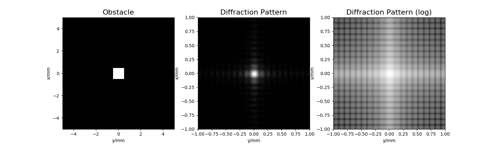

# Diffraction Simulator
Basic script for my Photonics course. Simulates plain wave propagation in Python using either Fresnel's or Fraunhoffer's approximation. 

## Requirements

- Python 3.* with _numpy_ and _maplotlib_ modules installed 

## Usage

Just run the script in the terminal using:
  ```bash
  python3 diffraction.py
 ```
and follow the script's instructions.

## Example Output

These are slightly outdated, but you will still get similar results:

<p align="center"> 

</p>

<p align="center"> 

</p>
